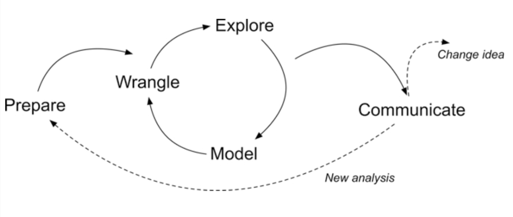
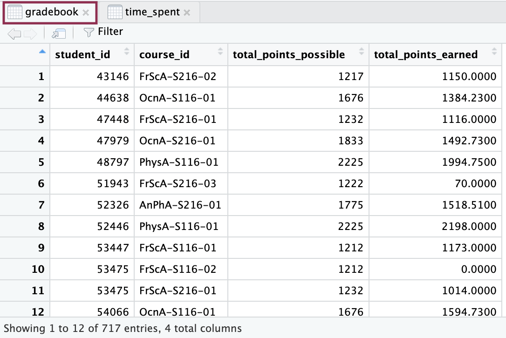
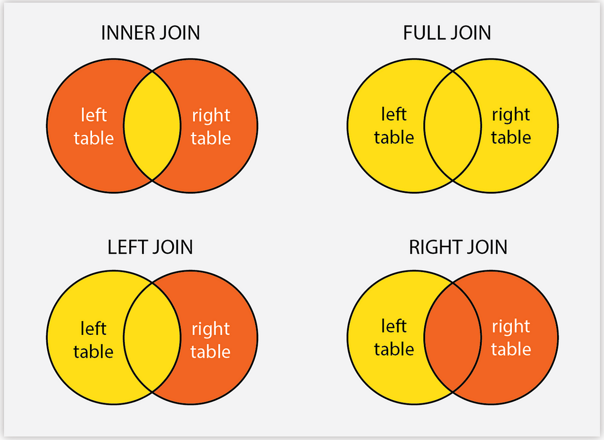
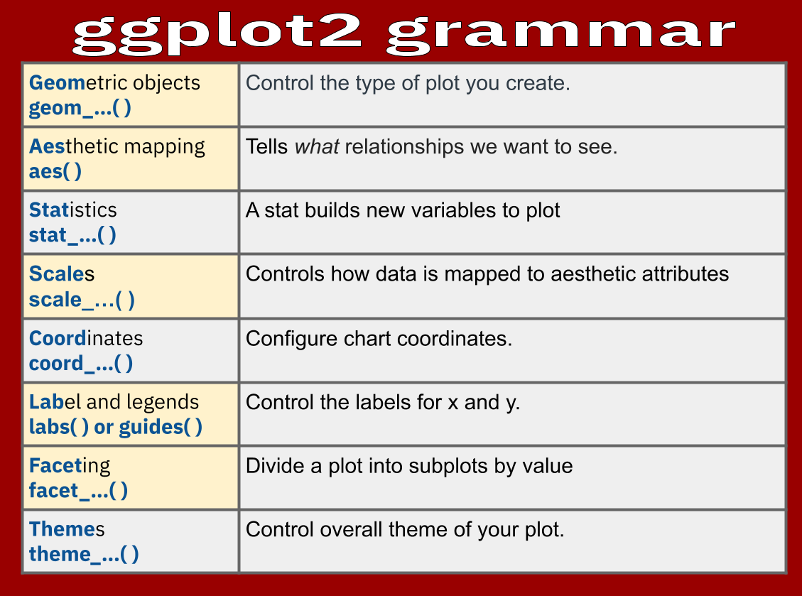

# 0. INTRODUCTION

We will focus on online science classes provided through a state-wide
online virtual school and conduct an analysis that help product
students' performance in these online courses. This case study is guided
by a foundational study in Learning Analytics that illustrates how
analyses like these can be used develop an early warning system for
educators to identify students at risk of failing and intervene before
that happens.

Over the next labs we will dive into the Learning Analytics Workflow as
follows:

**Steps of Data-Intensive Research Workflow**

{width="78%"}

1.  **Prepare**: Prior to analysis, it's critical to understand the
    context and data sources you're working with so you can formulate
    useful and answerable questions. You'll also need to become familiar
    with and load essential packages for analysis, and learn to load and
    view the data for analysis.
2.  **Wrangle**: Wrangling data entails the work of manipulating,
    cleaning, transforming, and merging data. In Part 2 we focus on
    importing CSV files, tidying and joining our data.
3.  **Explore**: In Part 3, we use basic data visualization and
    calculate some summary statistics to explore our data and see what
    insight it provides in response to our questions.
4.  **Model:** After identifying variables that may be related to
    student performance through exploratory analysis, we'll look at
    correlations and create some simple models of our data using linear
    regression.
5.  **Communicate:** To wrap up our case study, we'll develop our first
    "data product" and share our analyses and findings by creating our
    first web page using Markdown.
6.  **Change Idea:** Having developed a webpage using Markdown, share
    your findings with the colleagues. The page will include interactive
    plots and a detailed explanation of the analysis process, serving as
    a case study for other educators in your school. Present your
    findings at a staff meeting, advocating for a broader adoption of
    data-driven strategies across curricula.

------------------------------------------------------------------------

# 1. PREPARE (Module 1)

## About the Study

This case study is guided by a well-cited publication from two authors
that have made numerous contributions to the field of Learning Analytics
over the years. This article is focused on "early warning systems" in
higher education, and where adoption of learning management systems
(LMS) like Moodle and Canvas gained a quicker foothold.

Macfadyen, L. P., & Dawson, S. (2010). [Mining LMS data to develop an
"early warning system" for educators: A proof of
concept.](https://www.sciencedirect.com/science/article/pii/S0360131509002486?via%3Dihub)
*Computers & education*, *54*(2), 588-599.

Previous research has indicated that universities and colleges could
utilize Learning Management System (LMS) data to create reporting tools
that identify students who are at risk and enable prompt pedagogical
interventions. The present study validates and expands upon this idea by
presenting data from an international research project that explores the
specific online activities of students that reliably indicate their
academic success. This paper confirms and extends this proposition by
providing data from an international research project investigating
**which student online activities accurately predict academic
achievement.**

The **data analyzed** in this exploratory research was extracted from
the **course-based instructor tracking logs** and the **BB Vista
production server**.

Data collected on each student included 'whole term' counts for
frequency of usage of course materials and tools supporting content
delivery, engagement and discussion, assessment and
administration/management. In addition, tracking data indicating total
time spent on certain tool-based activities (assessments, assignments,
total time online) offered a total measure of individual student time on
task.

The authors used scatter plots for identifying potential relationships
between variables under investigation, followed by a a simple
correlation analysis of each variable to further interrogate the
significance of selected variables as indicators of student achievement.
Finally, a linear multiple regression analysis was conducted in order to
develop a predictive model in which a student final grade was the
continuous dependent variable.

+----------------------------------------------------------------------+
| **Introduction to the [Stakeholder]{.underline}**                    |
+======================================================================+
| **Name:** Alex Johnson                                               |
|                                                                      |
| **Role:** University Science Professor                               |
|                                                                      |
| **Experience:** 5 years teaching, enthusiastic about integrating     |
| technology in education                                              |
|                                                                      |
| **Goal:** Alex aims to improve student engagement and performance in |
| her online science classes.                                          |
+----------------------------------------------------------------------+

```{=html}
<style>
    .wrap-img {
        float: left;
        margin-right: 10px;
        width: 10%;
    }
</style>
```

{.wrap-img
alt="Teacher Persona"} ***Alex begins by understanding the importance of
data analysis in identifying students who might need extra support. The
cited foundational study motivates her to explore similar analyses to
develop her own early warning system.***

## Load libraries

Remember libraries are also called packages. They are shareable
collections of code that can contain functions, data, and/or
documentation and extend the functionality of the coding language.

`tidyverse` is a collection of R packages designed for data
manipulation, visualization, and analysis.

```{r}
#Load Libraries below needed for analysis
library(tidyverse)
```

## Data Source #1: Log Data

Log-trace data is data generated from our interactions with digital
technologies, such as archived data from social media postings. In
education, an increasingly common source of log-trace data is that
generated from interactions with LMS and other digital tools.

The data we will use has already been "wrangled" quite a bit and is a
summary type of log-trace data: the number of minutes students spent on
the course. While this data type is fairly straightforward, there are
even more complex sources of log-trace data out there (e.g., time stamps
associated with when students started and stopped accessing the course).

**Log Data Variables**

| Variable            | Description                                      |
|---------------------|--------------------------------------------------|
| `student_id`        | student's id at institution                      |
| `course_id`         | abbreviation for course, course number, semester |
| `gender`            | male/female/NA                                   |
| `enrollment_reason` | reason student decided to take the course        |
| `enrollment_status` | approved/enrolled, dropped, withdrawn            |
| `time_spent`        | Time spent in hours for entire course            |

: **Course Acronym Descriptions**

| Acronym | Course Name  |
|---------|--------------|
| AnPhA   | Anatomy      |
| BioA    | Biology      |
| FrScA   | Forensics    |
| OcnA    | Oceanography |
| PhysA   | Physics      |

## Data Source #2: Academic Achievement Data

**Academic Achievement Data Variables**

| Variable                | Description                         |
|-------------------------|-------------------------------------|
| `total_points_possible` | available points for the course     |
| `total_points_earned`   | points earned for the entire course |

## Data Source #3: Self-Report Survey

The third data source is a self-report survey. This was data collected
before the start of the course. The survey included ten items, each
corresponding to one of three motivation measures: interest, utility
value, and perceived competence. These were chosen for their alignment
with one way to think about students' motivation, to what extent they
expect to do well (corresponding to their perceived competence) and
their value for what they are learning (corresponding to their interest
and utility value).

**Self-Report Survey Variables**

| Variable  | Description         |
|-----------|---------------------|
| `int`     | interest in science |
| `tv`      | hours of TV watched |
| `Q1 -Q10` | survey questions    |

1.  I think this course is an interesting subject. (Interest)
2.  What I am learning in this class is relevant to my life. (Utility
    value)
3.  I consider this topic to be one of my best subjects. (Perceived
    competence)
4.  I am not interested in this course. (Interest---reverse coded)
5.  I think I will like learning about this topic. (Interest)
6.  I think what we are studying in this course is useful for me to
    know. (Utility value)
7.  I don't feel comfortable when it comes to answering questions in
    this area. (Perceived competence--reverse coded)
8.  I think this subject is interesting. (Interest)
9.  I find the content of this course to be personally meaningful.
    (Utility value)
10. I've always wanted to learn more about this subject. (Interest)

# 2. WRANGLE (Module 1)

## Import data

We will need to load in and inspect each of the data frames that we will
use for this lab. You will first read about the data frame and then
learn how to load (or read in) the data frame into the quarto document.

### **`time_spent`**

For our first data frame object, let's use the `read_csv()` function
from to import our `log-data.csv` file directly from our data folder.

We will save this data frame as an object called `time_spent`, to help
us to quickly recollect what function it serves in this analysis. To do
that, we need to enter this new name and assign its value using the `<-`
operator.

#### **👉 Your Turn** **⤵**

You can run any code in a code block by pressing the green arrowhead in
the top right corner. Try this one:

```{r}
#load log-data file from data folder
time_spent <- read_csv("data/log-data.csv")
time_spent
```

------------------------------------------------------------------------

### **`gradebook`**

Load the file `gradebook-summary.csv` from data folder and save the
object as `gradebook.`

❗️In R, everything is an **object**. An object can be a simple value
(like a number or a string), a complex structure (like a data frame or a
list), or even a function or a model. For example, when you load a CSV
file into R and store it in a variable, that variable is an object that
contains your dataset.

A **data set** typically refers to a collection of data, often stored in
a tabular format with rows and columns.

#### **👉 Your Turn** **⤵**

1.  Use the same function as before to read in the
    `gradebook-summary.csv` file.
2.  Make sure the output is assigned to a new object, this time called
    `gradebook`.
3.  Press the green arrow head to run the code.

```{r}
#load grade book data from data folder
#(add code below)
gradebook <- read_csv("data/gradebook-summary.csv",show_col_types = FALSE)
```

------------------------------------------------------------------------

### `survey`

Load the file `survey.csv` from data folder.

#### **👉 Your Turn** **⤵**

1.  Use the same function as before to read in the
    `gradebook-summary.csv` file.
2.  Make sure the output is assigned to a new object, this time called
    `survey`.
3.  Press the green arrow head to run the code.

```{r}
#load survey data from data folder
#(add code below)
survey <- read_csv("data/survey.csv",show_col_types = FALSE)
```

------------------------------------------------------------------------

## Inspect data

There are several ways you can look at data objects in R:

-   Simply typing the name of your object and running the code

```{r}
time_spent
```

-   Using `glimpse()`

```{r}
glimpse(gradebook)
```

-   Using the Global Environment Pane

{width="34%"}

{width="50%"}

-   Using `head()` and `tail()` to look at the first and last few rows

```{r}
#first few rows
head(survey)
```

```{r}
#last few rows
tail(survey)
```

-   Using `sample()`

```{r}
sample(survey)
```

#### **👉 Your Turn** **⤵**

Inspect the three datasets we loaded and answer the questions:

❓ What do you notice or wonder about?

-   \[YOUR RESPONSE HERE\]

❓ How many observations do you see?

-   \[YOUR RESPONSE HERE\]

❓ How many variables are there?

-   \[YOUR RESPONSE HERE\]

❓ What do you notice about the variable classes?

-   \[YOUR RESPONSE HERE\]

------------------------------------------------------------------------

## Tidy data

### `time_spent`

#### Use `separate()` function from `tidyr`

Using `separate()`, we will turn the `course_id` variable in
`time_spent` into three different variables: The course subject,
semester, and section.

The `c()` function in R is used used to combine or concatenate its
argument. You can use it to get the output by giving parameters inside
the function.

```{r}
#separate variable to individual subject, semester and section
time_spent %>%  
  separate(course_id,
           c("subject", "semester", "section"))

#inspect
time_spent
```

Make sure to save it to the `time_spent` object. Saving an object is
accomplished by using an assignment operator, which looks kind of like
an arrow `<-` It is generally best practice to put the assigned object
on the left, at the beginning of the code.

```{r}
time_spent <- time_spent %>% #save function output to existing object 
  separate(course_id,
           c("subject", "semester", "section"))

#inspect
time_spent
```

#### Use `mutate()` function from `dplyr`

As you can see from the dataset, `time_spent` variable is *not* set in
hours. Let's change that.

In R, you can create new variables in a dataset (data frame or tibble)
using **`mutate(),`** which allows you to add new columns to your data
frame or modify existing ones.

```{r}
#mutate minutes to hours on time spent and save as new variable.
time_spent <- time_spent %>% 
  mutate(time_spent_hours = time_spent / 60)

#inspect 
time_spent
```

### `gradebook`

#### Use `separate()` function from `tidyr`

Now, we will work on the `gradebook` dataset. Like the previous dataset,
we will separate the `course_id` variable again.

#### **👉 Your Turn** **⤵**

1.  Use the pipe operator to separate `course_id` variable (like we just
    did in `time_spent`).
2.  Run the code.

```{r warning=FALSE, message=FALSE}
#separate the course_id variable and save to 'gradebook' object
#YOUR CODE HERE
gradebook <- gradebook %>% separate(course_id,
           c("subject", "semester", "section"))

#inspect
#YOUR CODE HERE
gradebook
```

------------------------------------------------------------------------

#### Use the `mutate()` function from `dplyr`

As you can see in `gradebook`, it is hard to see `total_points_earned`
as a proportion. We can use `mutate()` to make it a percentage.

#### **👉 Your Turn** **⤵**

1.  Take `total_points_earned` divide by `total_points_possible` and
    multiply by 100. Save this as `proportion_earned`.
2.  Run the code.

```{r warning=FALSE, message=FALSE}

# Mutate to a proportion_earned, take 'total points earned' divide by 'total points possible.' Save as a new variable proportion_earned.
gradebook <- gradebook %>%
  mutate(proportion_earned = (total_points_earned /total_points_possible) *100)

#YOUR CODE HERE

#inspect data
gradebook
```

------------------------------------------------------------------------

### `survey`

Let's process our data. First though, take a quick look again by typing
`survey` into the console or using a preferred viewing method to take a
look at the data.

❓ Does it appear to be the correct file? What do the variables seem to
be about? What wrangling steps do we need to take? Taking a quick peak
at the data helps us to begin to formulate answers to these and is an
important step in any data analysis, especially as we *prepare* for what
we are going to do.

```{r warning=FALSE, message=FALSE}
#inspect data to view the column names
survey
```

#### **👉 Your turn** **⤵**

💡 Look at the variable names. Add one or more of the things you notice
or wonder about the data here:

-   \[YOUR RESPONSES HERE\]

-   \[YOUR RESPONSES HERE\]

------------------------------------------------------------------------

You may have noticed that `student_ID` is not formatted *exactly* the
same as `student_id` in our other files. This is important because in
the next section when we "join," or merge, our data files, these
variables will need to have identical names.

#### Use the `janitor` package

Fortunately the
{[janitor](https://garthtarr.github.io/meatR/janitor.html)} package has
simple functions for examining and cleaning dirty data. It was built
with beginning and intermediate R users in mind and is optimized for
user-friendliness. There is also a handy function called `clean_names()`
in the {janitor} package for standardizing variable names.

#### **👉 Your Turn** **⤵**

First, add the `janitor` package using the `library()` function.

```{r warning=FALSE, message=FALSE}
# load janitor library to clean variable names that do not match
#YOUR CODE HERE
library(janitor)
```

1.  Clean the columns by adding the `survey` object to the
    `clean_names()` function and saving it to the`survey` object.
2.  Inspect the data.
3.  Run the code.

```{r warning=FALSE, message=FALSE}
#clean columns of the survey data and save to survey object
#(add code below - some code is given to you)

survey <- clean_names(survey)

#inspect data to check for consistency with other data
#(add code below)

survey
```

------------------------------------------------------------------------

### Data merging and reshaping

#### Join the `gradebook` and `time_spent` datasets

As a reminder, there are different joins that we could use to combine
our datasets:

{width="467"}

Source:
<https://medium.com/>(imanjokko/data-analysis-in-r-series-vi-joining-data-using-dplyr-fc0a83f0f064)

A `full_join()` is best for our need to combine information from all
three datasets. `full_join()` returns *all* of the records in a new
table, whether it matches on either the left or right tables. If the
table rows match, then a join will be executed, otherwise it will return
NULL in places where a matching row does not exist.

Similar to what we learned in the code-a-long, we will combine the
`gradebook` and `time_spent` datasets. We first should identify the
variables (column names) to combine. In this case, we will use the
following:

-   `student_id`

-   `subject`

-   `semester`

-   `section`

```{r}
#use single join to join data sets by student_id, subject, semester and section.
joined_data <- full_join(gradebook, time_spent, 
                         by = c("student_id", "subject", "semester", "section"))

#inspect 
joined_data
```

As you can see, we have the new dataset `joined_data`. Those 12
variables came from the `gradebook` and `time_spent` datasets.

#### Join the `survey` and `joined_data` data sets

#### **👉 Your Turn** **⤵**

1.  Use the `full_join()` function to join `joined_data` with `survey`,
    identifying the following variables:

    -   `student_id`

    -   `subject`

    -   `semester`

    -   `section`

2.  Save to a new object called `data_to_explore`.

3.  Inspect the data.

4.  Run the code.

```{r eval = FALSE}
#use join to join data sets by student_id, subject, semester and section.
#(add code below - some code has been added for you)
data_to_explore  <- full_join(survey, joined_data, 
                         by = c("student_id", "subject", "semester", "section"))
  
#inspect
data_to_explore
```

**DON'T PANIC if you are getting an error - read below!!**

These datasets cannot be joined because the class (data type) of
`student_id` is different than `joined_data`.

------------------------------------------------------------------------

#### **👉Your Turn** **⤵**

❓ Check out what class `student_id` is in `joined_data` compared to
`survey`. What do you notice? (Hint: think about the `class()`)

-   \[YOUR ANSWER HERE\]

------------------------------------------------------------------------

#### Use `as.character()`

We need to change `joined_data`'s `student_id` variable into a character
class to match that of `survey` using `mutate()`.

#### **👉 Your Turn** **⤵**

1.  Use the `mutate()` function and `as.character()` function to change
    `student_id` variable from numeric to character class.

2.  Save the new value to the `student_id` variable.

3.  Run the code.

```{r}
#mutate to change variable class from double or numeric to character
#(add code below - some code has been already added)
joined_data <- joined_data %>%
  mutate(student_id = as.character(student_id))

#inspect
joined_data
```

------------------------------------------------------------------------

#### NOW `full_join()`!

#### **👉 Your Turn** **⤵**

Now, that the variables are the same class:

1.  Use the `full_join()` function to join `joined_data` with `survey`,
    identifying the following variables:
    -   `student_id`

    -   `subject`

    -   `semester`

    -   `section`
2.  Save to a new object called `data_to_explore`.
3.  Inspect the data.
4.  Run the code.

```{r}
#try again to together the grade_book and log_wrangled
#(add code below - some code has been already added)
data_to_explore  <- full_join(survey, joined_data, 
                         by = c("student_id", "subject", "semester", "section"))
  
#inspect
data_to_explore
```

------------------------------------------------------------------------

Let's also transform the subject names to a more convenient format:

```{r}
data_to_explore <- data_to_explore %>%
  mutate(subject = case_when(
    subject == "AnPhA"  ~ "Anatomy",
    subject == "BioA"   ~ "Biology",
    subject == "FrScA"  ~ "Forensics",
    subject == "OcnA"   ~ "Oceanography",
    subject == "PhysA"  ~ "Physics",
    TRUE ~ subject  #This line keeps the original value if none of the conditions above are met
  ))
data_to_explore
```

{.wrap-img
alt="Teacher Persona"}**Alex follows the steps to load and wrangle data,
reflecting on how each step can provide insights into her students'
engagement levels. She is particularly interested in understanding
patterns in the time students spend on different course materials and
how these patterns correlate with their performance.**

## Filter and sort data

### Use `filter()` from the `dplyr` package

We can identify students at risk of failing the course using the filter
function looking at students below 70:

```{r}
#Filter students with lower grades
at_risk_students <- data_to_explore %>%
  filter(proportion_earned<70)

#Print the at-risk students
at_risk_students
```

You can also use `arrange()` to sort values:

```{r}
#sort in ascending order
data_to_explore %>%
  arrange(proportion_earned)
```

`arrange(desc())` sorts in descending order:

```{r}
#sort in descending order
data_to_explore %>%
  arrange(desc(proportion_earned))
```

#### **👉 Your Turn** **⤵**

Think what other factors are important to identify students at risk. Run
your code and analyze the results:

```{r}
#YOUR CODE HERE:

```

------------------------------------------------------------------------

### Export and back up data

Now let's write the file to our **data folder** using `write_csv()` to
save for later or download.

```{r eval=FALSE}
# add the function to write data to file to use later
write_csv(data_to_explore, "module_1/data/data_to_explore.csv")
```

Check the data folder to confirm the location of your new file.

## 🛑 Stop here! Congratulations, you finished the first part of the case study.

# 3. EXPLORE (Module 2)

## Exploratory Data Analysis

### Use the `skimr` package

We've already wrangled our data, but let's look at the data frame to
make sure it is still correct. A quick way to look at the data frame is
with
[`skimr`](https://cran.r-project.org/web/packages/skimr/vignettes/skimr.html).

This output is best for internal use. This is because the output is
rich, but not well-suited to exporting to a table that you add, for
instance, to a Google Docs or Microsoft Word manuscript.

Of course, these values can be entered manually into a table, but we'll
also discuss ways later on to create tables that are ready, or
nearly-ready-to be added directly to manuscripts.

#### **👉 Your Turn** **⤵**

1.  Load `skimr` with the correct function.

```{r messages=FALSE, warning=FALSE}
#load library by adding skimr as the package name
#(add code below)
library(skimr)
```

Normally you would do this above, but we want to make sure you know
which packages are used with the new functions.

2.  Next, use `skim()` to view `data_to_explore`.

```{r messages=FALSE, warning=FALSE}
#skim the data by adding the skim function in front of the data
#(add code below)
skim(data_to_explore)
```

3.  Finally, use the `group_by()` function (from `dplyr`) on the
    `subject` variable, then the `skim()` function (from `skimr`).

```{r messages=FALSE, warning=FALSE}
data_to_explore %>%
  group_by(subject)%>%
  skim()
```

------------------------------------------------------------------------

### Missing values

The `summary()` function provides additional information. It can be used
for the entire dataset or individual variables.

```{r}
# use the summary() function to look at your data.
summary(data_to_explore)
```

If you want to look for NA's in all your columns, you can use `is.na()`
(from `dplyr`).

```{r}
data_to_explore %>%
  select(everything()) %>%  # replace to your needs
  summarize(across(everything(), ~ sum(is.na(.)))) #across() applies functions to multiple columns
```

#### **👉 Your Turn** **⤵**

Let's look at how many NAs are in the `semester` column only. Most of
the code is completed, but you need to:

1.  Add the `semester` column to the `select()` function
2.  Add `semester` to the `sum(is.na())` function

```{r eval = FALSE}
data_to_explore %>%
  select(#VARIABLE HERE) %>%  # Fill in the variable you want to look at
  summarize(na_count = sum(is.na(#VARIABLE HERE)))  # count NA values in the chosen variable
```

------------------------------------------------------------------------

## Exploration with Data Visualization using `ggplot2`

`ggplot2` is designed to work iteratively. You start with a layer that
shows the raw data, then add layers of annotations and statistical
summaries. `ggplot2` is a part of the `tidyverse`, so we do not need to
load it again.

Here are three resources for `ggplot2`:

-   The book [*GGPLOT: Elegant Graphics for Data
    Analysis*](https://ggplot2-book.org/introduction.html).

-   This [r-graph gallery](https://r-graph-gallery.com/) that includes
    code.

-   This cheat sheet!

{width="382" height="340"}

*Elegant Graphics for Data Analysis* states

> every `ggplot2` plot has three key components:
>
> -   data,
>
> -   a set of aesthetic mappings between variables in the data and
>     visual properties, and
>
> -   at least one layer which describes how to render each observation.
>     Layers are usually created with a `geom()` function."

We'll start off by creating some basic visualizations that examines a
continuous variable of interest: Bar plots and histograms.

### One continuous variable: Bar plot

For this visualization, we will be guided by the following research
question about another continuous variable:

❓ Which online course had the largest enrollment numbers?

❓ Which variable should we be looking at?

#### **👉 Your Turn** **⤵**

1\. Before visualizing anything, inspect `data_to_explore` to understand
what variables we might need to explore the research questions.

```{r messages=FALSE, warning=FALSE}
#inspect the data frame
#(add code below)
data_to_explore
```

------------------------------------------------------------------------

#### **Level a: The most basic level for a plot**

As a reminder, the most basic visualization that you can make with
`ggplot2` includes three layers:

-   Layer 1: **data**: data_to_explore.csv
-   Layer 2: **`aes()` function** - one continuous variable:
    -   `subject` mapped to x position
-   Layer 3: **Geom**:`geom_bar()` function - bar graph

```{r messages=FALSE, warning=FALSE}
#layer 1: add data 
# layer 2: add aesthetics mapping
ggplot(data_to_explore, aes(x = subject)) +
#layer 3: add geom 
  geom_bar() +
labs(title = "Number of Observations per Subject",
       x = "Subject",
       y = "Count")
```

#### Level b: Add another layer with labels

To communicate context, we can add the following labels to our `ggplot2`
visualization as Layer 4.

-   Title: "Number of Student Enrollments per Subject"

-   Caption: "Which online courses have had the largest enrollment
    numbers?"

```{r messages=FALSE, warning=FALSE}
#layer 1: add data 
# layer 2: add aesthetics mapping
ggplot(data_to_explore, aes(x = subject)) +
#layer 3: add geom 
  geom_bar() +

#layer 4: add labels
    labs(title = "Number of Student Enrollments per Subject",
       caption = "Which online courses have had the largest enrollment numbers?")
```

#### Level c: Add **scale with a different color**.

We will be guided by the following research question.

❓ What can we notice about gender?

For Layer 5, we'll add scale by telling the `aes()` function to make the
fill colors of the bars correspond to the `gender` variable.

```{r messages=FALSE, warning=FALSE}
#layer 1: add data 
# layer 2: add aesthetics mapping and #layer 5 scale
ggplot(data_to_explore, aes(x = subject, fill = gender)) +
#layer 3: add geom 
  geom_bar() +

#layer 4: add labels
    labs(title = "Gender Distribution of Students Across Subjects",
       caption = "Which subjects enroll more female students?")
```

### One continuous variable: **Histogram**

Now we'll create a basic visualization that examines the relationship
between a different continuous variable using a histogram via
`geom_histogram()`.

For this visualization, we will be guided by the following research
question:

❓ What number is the number of hours students watch TV?

#### **👉 Your Turn** **⤵**

Write a new visualization using `geom_histogram()`.

-   **Data**: `data_to_explore`
-   **`aes()` function:** `tv` variable mapped to the `x` position
-   **Geom**: `geom_histogram()` (already included in code block)
-   **Title:** "Number of Hours Students Watch TV per Day"
-   **Caption:** "Approximately how many students watch 4+ hours of TV
    per day?", or something similar that captures the research question

**NEED HELP? Try** [Statistical Tools for High-throughput Data Analysis
(STHDA)](#0)!

```{r messages=FALSE, warning=FALSE}
# Add data
ggplot(data_to_explore, aes(x = tv)) +
  geom_histogram(bins = 5) + #specifies that the variable gets sorted into 5 bins
# Add the labels
  labs(title = "Histogram of TV Watching Hours",
       caption = "Approximately how many students watch 4+ hours of TV per day?",
       x = "TV Watching Hours",
       y = "Count")
```

------------------------------------------------------------------------

### Two categorical variables: Heatmap

Create a basic visualization that examines the relationship between
**two** categorical variables using a heatmap via `geom_tile()`.

For this visualization, we will be guided by the following research
question:

❓ What are the reasons for enrollment in various courses?

We can make a heatmap (via `geom_tile()`) to visualize the relationship
between the course subject and reasons for enrollment.

#### **👉 Your Turn** **⤵**

-   **Data**: `data_to_explore`
-   First, use the `count()` function for the categorical variables
    `subject` & `enrollment`, then
-   **`ggplot()`**
-   **`aes()`**:
    -   `subject` mapped to `x` position
    -   `enrollment_reason` mapped to `y` position
-   **Geom**: `geom_tile()`
-   **Title:** "Reasons for Enrollment by Subject"
-   **Caption**: "Which subjects were the least available at local
    schools?"

We've added extra code as `scale_fill_gradient()` and `labs()` to help
show a heatmap's effectiveness. Play around with it if you'd like!

```{r messages=FALSE, warning=FALSE}

data_to_explore %>%
  count(subject, enrollment_reason) %>%
  ggplot(aes(x = subject, y = enrollment_reason, fill = n)) + 
    geom_tile() +
    scale_fill_gradient(low = "orange", high = "maroon") +  #Try changing one color to "red"!
    labs(title = "Reasons for Enrollment by Subject",
         caption = "Which subjects were the least available at local schools?",
         x = "Subject",
         y = "Enrollment Reason",
         fill = "Count")
```

------------------------------------------------------------------------

### Two continuous variables: Scatter plot

Create a basic visualization that examines the relationship between two
continuous variables using a scatter plot via `geom_point()`.

For this visualization, we will be guided by the following research
question:

❓ Can we predict the grade on a course from the time spent in the
course LMS?

#### **👉 Your turn** **⤵**

Take another look at your data:

```{r message=FALSE, warning=FALSE}
#look at the data frame
 #(add code below)
head(data_to_explore)
```

❓ Which variables should we be looking at?

-   \[YOUR RESPONSE HERE\]

------------------------------------------------------------------------

#### Level a. The most basic level for a **scatter** plot

#### **👉 Your Turn** **⤵**

-   **Data**: `data_to_explore`

-   **`aes()`**: Two continuous variables

    -   Time spent in hours mapped to `x` position
    -   Proportion earned mapped to `y` position

-   **Geom**: `geom_point()`

```{r messages=FALSE, warning=FALSE}
#(add code below)
#layer 1: add data and aesthetics mapping 
ggplot(data_to_explore,
       aes(x = time_spent_hours, 
           y = proportion_earned)) +
#layer 2: +  geom function type
  geom_point()
```

------------------------------------------------------------------------

#### Level b. Add another layer with labels

#### **👉 Your Turn** **⤵**

-   **Title**: "How Time Spent on Course LMS is Related to Points Earned
    in the course"
-   **x label**: "Time Spent (Hours)"
-   **y label**: "Proportion of Points Earned"

```{r messages=FALSE, warning=FALSE}
#(add code below)
ggplot(data_to_explore, aes(x = time_spent_hours, y = proportion_earned)) +
  geom_point() +
  labs(title = "Relationship Between Time Spent and Proportion of Points Earned",
       x = "Time Spent (Hours)",
       y = "Proportion of Points Earned")
```

------------------------------------------------------------------------

#### Level c. Add **scale** with a different color.

❓ Can we notice anything about enrollment status?

We'll add scale by telling the `aes()` function to make the colors of
the points correspond to the `enrollment_status` variable.

#### **👉 Your Turn** **⤵**

Create a scatter plot with color based on `enrollment_status`.

```{r messages=FALSE, warning=FALSE}
#(add code below)
ggplot(data_to_explore, aes(x = time_spent_hours, y = proportion_earned, color = enrollment_status)) +
  geom_point() +
  labs(title = "How Time Spent on Course LMS is Related to Points Earned in the course?",
       x = "Time Spent (Hours)",
       y = "Proportion of Points Earned",
       color = "Enrollment Status")
```

------------------------------------------------------------------------

#### Level d. Divide up graphs using facet to visualize by subject.

The `facet_wrap()` function allows you to generate multiple
visualizations side-by-side for easier comparison. We'll use `subject`
as the variable.

#### **👉 Your Turn** **⤵**

Create a scatter plot with facets for each subject using `facet_wrap()`.

```{r message=FALSE, warning=FALSE}
#(add code below)
ggplot(data_to_explore, aes(x = time_spent_hours, y = proportion_earned, color = enrollment_status)) +
  geom_point() +
  facet_wrap(~subject) +
  labs(title = "Relationship Between Time Spent and Proportion of Points Earned by Subject",
       x = "Time Spent (Hours)",
       y = "Proportion of Points Earned",
       color = "Enrollment Status")
```

------------------------------------------------------------------------

#### Level e. Remove NAs from plot

1.  Start with `data_to_explore`.
2.  Pipe in an argument to `drop_na()` from:
    -   `time_spent_hours`
    -   `proportion_earned`
    -   `enrollment_status`
3.  Use your previous `ggplot()` code from above. Remember that you
    already piped in `data_to_explore`, so you can remove it from the
    first argument after `ggplot()`.

```{r messages=FALSE, warning=FALSE}
#(add code here)
data_to_explore %>%
  drop_na(time_spent_hours, proportion_earned, enrollment_status, subject) %>%
  ggplot(aes(x = time_spent_hours, 
             y = proportion_earned, 
             color = enrollment_status)) +
  geom_point() +
  labs(title = "Relationship Between Time Spent and Proportion of Points Earned by Subject",
       x = "Time Spent (Hours)",
       y = "Proportion of Points Earned",
       color = "Enrollment Status") +
  facet_wrap(~subject)
```

------------------------------------------------------------------------

{.wrap-img alt="Teacher Persona"}

***As Alex explores the data through visualizations and summary
statistics, she begins to see trends that could indicate which students
are at risk. Her observations guide her to consider changes in her
teaching approach or additional support for certain students.***

## 🛑 Stop here! Congratulations, you finished the second part of the case study.

# 4. MODEL (Module 3)

As highlighted in.[Chapter 3 of Data Science in Education Using
R](https://datascienceineducation.com/c03.html), the **Model** step of
the data science process entails "using statistical models, from simple
to complex, to understand trends and patterns in the data."

The authors note that while descriptive statistics and data
visualization during the **Explore** step can help us to identify
patterns and relationships in our data, statistical models can be used
to help us determine if relationships, patterns and trends are actually
meaningful.

## Simple Correlation

As highlighted in @macfadyen2010, scatter plots are a useful initial
approach for identifying potential correlational trends between
variables under investigation, but to further interrogate the
significance of selected variables as indicators of student achievement,
a simple correlation analysis of each variable with student final grade
can be conducted.

There are two efficient ways to create correlation matrices, one that is
best for internal use, and one that is best for inclusion in a
manuscript.

### `correlate()`

The `corrr` package provides a way to create a correlation matrix in a
`tidyverse`-friendly way. Like for the `skimr` package, it can take as
little as a line of code to create a correlation matrix. If unfamiliar,
a correlation matrix is a table that presents how *all of the variables*
are related to *all of the other variables*.

#### **👉 Your Turn** **⤵**

First, load the `corrr` package using the correct function. You may need
to `install.packages()` in the console if this is your first time using
loading the package.

```{r messages=FALSE, warning=FALSE}
# load in corrr library
#(add code below)
library(corrr)
```

Look and see if there is a simple correlation between time spent in
hours and the proportion of points earned:

1\. Use `data_to_explore`

2\. `select()`: - `time-spent-hours` - `proportion_earned`

3\. Use `correlate()`

```{r messages = FALSE, warning=FALSE}
#(add code below)
data_to_explore %>% 
  select(proportion_earned, time_spent_hours) %>%
  correlate()
```

------------------------------------------------------------------------

### `fashion()`

For **printing** purposes, the `fashion()` function can be added for
converting a correlation into a cleanly formatted matrix, with leading
zeros removed, spaces for signs, and the diagonal (or any NA) left
blank.

```{r messages=FALSE, warning=FALSE}
#add fashion function
data_to_explore %>% 
  select(proportion_earned, time_spent_hours) %>% 
  correlate() %>% 
  rearrange() %>%
  shave() %>%
  fashion()
```

#### **👉 Your Turn⤵**

❓ What could we write up for a manuscript in APA format or another
format? Offer a short summary below:

-   *In the study, Pearson's correlation coefficient was calculated to
    assess the relationship between the proportion of course materials
    earned and the time spent in hours. The analysis revealed a moderate
    positive correlation of .44 between these variables, suggesting that
    as the time students spent on course materials increased, so did
    their proportion of earned materials (pairwise complete observations
    were used to handle missing data).*

❓ What other variables would you like to check out?

-   \[YOUR RESPONSE HERE\]

Take some of those variables and explore them using `correlate():`

```{r messages=FALSE, warning=FALSE}
#(add code below)
```

------------------------------------------------------------------------

### APA Formatting

While `corrr` is a nice package to quickly create a correlation matrix,
you may wish to create one that is ready to be added directly to a
dissertation or journal article. `apaTables` is great for creating more
formal forms of output that can be added directly to an APA-formatted
manuscript. It also has functionality for regression and other types of
model output.

However, `apaTables` is not as friendly to `tidyverse` functions. First,
we need to select only the variables we wish to correlate. Then, we can
use that subset of the variables as the argument to the
`apa.cor.table()` function.

#### **👉 Your Turn** **⤵**

Run the following code to create a subset of the larger
`data_to_explore` data frame with the variables you wish to correlate,
then create a correlation table using `apa.cor.table()`.

1.  Load `apaTables` library.
2.  Save your selected variables for comparison to a new object
    `data_to_explore_subset.`
3.  Run `apa.cor.table()`.

```{r messages=FALSE, warning=FALSE}
# read in apatables library
#(add code below)
library(apaTables)

data_to_explore_subset <- data_to_explore %>% 
  select(time_spent_hours, proportion_earned, int)

apa.cor.table(data_to_explore_subset)
```

------------------------------------------------------------------------

This may look nice, but how do we add this into a dissertation or
article that you might be interested in publishing?

Read the documentation for `apa.cor.table()` by running
`?apa.cor.table()` in the console. Look through the documentation and
examples to understand how to output a file with the formatted
correlation table, and then run the code to do that with your subset
`data_to_explore_subset`.

```{r messages=FALSE, warning=FALSE}

?apa.cor.table

apa.cor.table(data_to_explore_subset, filename = "cor-table.doc")
```

You should now see a new Word document in your project folder called
`survey-cor-table.doc`. Click on that and you'll be prompted to download
from your browser.

## Linear Regression

In brief, a linear regression model involves estimating the
relationships between one or more *independent variables* with one
dependent variable. Mathematically, it can be written like the
following.

$$
\operatorname{dependentvar} = \beta_{0} + \beta_{1}(\operatorname{independentvar}) + \epsilon
$$

❓ Does time spent predict grade earned?

#### **👉 Your Turn** **⤵**

Use `lm()` to estimate a model in which `proportion_earned` is the
dependent variable. It is predicted by one independent variable,
`time_spent_hours`, with an interaction term `int` (interest in
science).

```{r messages=FALSE, warning=FALSE}
#(add code here)
lm(proportion_earned ~ time_spent_hours +int, 
   data = data_to_explore)
```

------------------------------------------------------------------------

We can see that the intercept is now estimated at 44, which tells us
that when students' time spent and interest are equal to zero, they are
likely fail the course (unsurprisingly). Note that that estimate for
interest in science is 4.6, so for every one-unit increase in `int`, we
should expect about a 5 percentage point increase in their grade.

We can save the output of the function to an object. Let's call it `m1`
for "Model 1." We can then use the `summary()` function built into R to
view a much more feature-rich summary of the estimated model.

```{r messages=FALSE, warning=FALSE}
# save the model
m1 <- lm(proportion_earned ~ time_spent_hours + int, data = data_to_explore)

```

#### **👉 Your Turn** **⤵**

Run a summary for the model you just created, called `m1.`

```{r messages=FALSE, warning=FALSE}
#run the summary
summary(m1)
```

------------------------------------------------------------------------

Let's save this as a nice APA table for possible publication.

```{r messages=FALSE, warning=FALSE}
# use the {apaTables} package to create a nice regression table that could be used for later publication.
apa.reg.table(m1, filename = "lm-table.doc")
```

{.wrap-img
alt="Teacher Persona"} ***By creating simple models, Alex hopes to
predict student outcomes more accurately. She is interested in how
variables like time spent on tasks correlate with student grades and
uses this information to adjust her instructional strategies.***

#### Summarize predictors

The `summarize()` function from the `dplyr` package creates summary
statistics such as the mean, standard deviation, or the minimum or
maximum of a value. At its core, think of `summarize()` as a function
that returns a single statistics summarizing a single column.

#### **👉 Your Turn** **⤵**

In the space below find the mean `int` of students using `summarize()`,
removing any NAs.

```{r messages=FALSE, warning=FALSE}
data_to_explore %>% 
  summarize(mean_interest = mean(int, na.rm = TRUE))
```

------------------------------------------------------------------------

The mean value for interest is quite high. If we multiply the estimated
relationship between interest and proportion of points
earned---0.046---by this, the mean interest across all of the
students---we can determine that students' estimated final grade was
0.046 X 4.3, or **0.197**.

#### **👉 Your Turn** **⤵**

Do the same for `time_spent_hours` by finding the mean and removing any
NAs using `summarize()`.

```{r message=FALSE, warning=FALSE}
#add code here
data_to_explore %>% 
  summarize(mean_time = mean(time_spent_hours, na.rm = TRUE))
```

------------------------------------------------------------------------

For hours spent, the average students' estimated final grade was 0.0042
X 30.48, or **0.128**.

If we add both **0.197** and **0.128** to the intercept, 0.449, that
equals 0.774, or about 77%. In other words, a student with average
interest in science who spent an average amount of time in the course
earned a pretty average grade.

### Checking Assumptions

Great! Now that you have defined your linear model `m1` in R, which
predicts `proportion_earned` based on `time_spent_hours` and the
interaction term `int`.

Let's go through how to check the assumptions of this linear model using
the various diagnostic plots and tests.

We'll need to check:

-   Linearity and Interaction Effects

-   Residuals Analysis

-   Normality of Residuals

-   Multicollinearity

#### Linearity and Interaction Effect

Since our model includes an interaction term (`int`), it's good to first
check if the interaction is meaningful and whether the linearity
assumption holds for the predictors in relation to the dependent
variable.

```{r}
ggplot(data_to_explore, aes(x=time_spent_hours, y=proportion_earned, color=int)) +
  geom_point() +
  geom_smooth(method="lm", se=FALSE)
```

This plot helps visualize if the interaction term significantly affects
the relationship between your predictors and the dependent variable.

#### Residuals Analysis

Next, we'll plot the residuals against the fitted values to check for
independence, homoscedasticity, and any unusual patterns.

```{r}
plot(residuals(m1) ~ fitted(m1))
abline(h = 0, col = "red")
```

Look for a random dispersion of points. Any pattern or funnel shape
indicates issues with homoscedasticity or linearity.

#### Normality of Residuals

A deviation from the straight line in the Normal Q-Q plot indicates
deviations from normality.

```{r}
qqnorm(residuals(m1))
qqline(residuals(m1))
```

The Shapiro-Wilk test is another way to test normality.

```{r}
shapiro.test(residuals(m1))
```

-   **W statistic:** The test statistic W is 0.88967. This value
    indicates the extent to which the data are normally distributed. W
    values close to 1 suggest that the data closely follow a normal
    distribution. In this case, a W value of 0.88967 suggests some
    deviation from normality.

-   **p-value:** The p-value is less than 2.2e-16 (a very small number
    close to zero). In statistical testing, a p-value less than the
    chosen significance level (typically 0.05) leads to the rejection of
    the null hypothesis.

#### Multicollinearity

We can use `vif()` from the `car` package to identify multicolinearity.
You try it!

#### **👉 Your Turn** **⤵**

-   Load the package `car`.

-   Use the `vif()` function for your model `m1`.

```{r}
#(add code below)
library(car)
vif(m1)
```

------------------------------------------------------------------------

**Interpretation of VIF Scores**

| VIF Value | Interpretation |
|----|----|
| = 1 | No correlation among the predictor and all other predictors |
| \< 5 | Generally indicates a moderate level of multicollinearity |
| \>= 5 to 10 | May indicate a problematic amount of multicollinearity, depending on the context and sources |
| \>10 | Signifies high multicollinearity that can severely distort the least squares estimates |

Both of the VIF scores are slightly above 1, which suggests that there
is **almost no multicollinearity** among these predictors. This is a
good sign, indicating that each predictor provides unique and
independent information to the model, not unduly influenced by the other
variables.

Our model was violated and does not follow a normality. However, we are
going to practice other functions as if it passed all assumptions.
Assumption testing is just for you to know how to do in the future. You
will need to correct issues like normality by exploring data
transformations, adding polynomial or interaction terms to the model, or
using a different type of regression model that does not assume
normality of residuals.

## 🛑 Stop here! Congratulations, you finished the third part of the case study.

# 5. COMMUNICATE (Module 4)

For your final **👉 Your Turn**, your goal is to distill our analysis
into a Quarto "data product" designed to illustrate key findings. Feel
free to use the template in the lab 4 folder.

The final step in the workflow/process is sharing the results of your
analysis with wider audience. Krumm et al. @krumm2018 have outlined the
following 3-step process for communicating with education stakeholders
findings from an analysis:

1.  **Select.** Communicating what one has learned involves selecting
    among those analyses that are most important and most useful to an
    intended audience, as well as selecting a form for displaying that
    information, such as a graph or table in static or interactive form,
    i.e. a "data product."

2.  **Polish**. After creating initial versions of data products,
    research teams often spend time refining or polishing them, by
    adding or editing titles, labels, and notations and by working with
    colors and shapes to highlight key points.

3.  **Narrate.** Writing a narrative to accompany the data products
    involves, at a minimum, pairing a data product with its related
    research question, describing how best to interpret the data
    product, and explaining the ways in which the data product helps
    answer the research question and might be used to inform new
    analyses or a "change idea" for improving student learning.

#### **👉 Your Turn** **⤵**

Create a data story with our current data set, or your own. Make sure to
use the LA workflow as your guide to include:

-   Develop a research question

-   Add `ggplot` visualizations

-   Offer a model (with visualizations)

-   Communicate by writing up a short write up for intended
    stakeholders. Remember to write it in terms the stakeholders
    understand.

-   \[ENTER YOUR RESPONSE HERE\]

------------------------------------------------------------------------

{.wrap-img
alt="Teacher Persona"} ***Finally, Alex prepares to communicate her
findings. She creates a simple web page using Markdown to share her
insights with colleagues. This acts as a practical example of how data
can inform teaching practices.***

## 🏆 Congratulations, you finished the case study!
