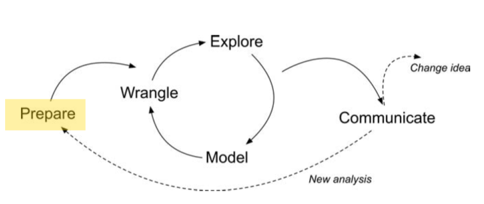
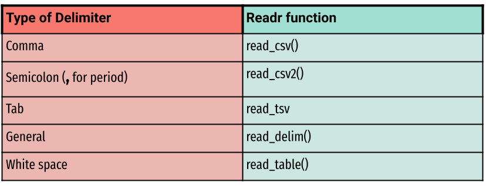

## Welcome to the LAW Code Along for Module 1

- Learning Analytics Workflow (LAW) is designed for those seeking an
  introductory understanding of learning analytics using basic R
  programming skills, particularly in the context of STEM education
  research.

- The following Code Along is aimed at preparing you for the first
  section of the case study.

 <br/>

::: notes
**Prepare** for a data-intensive analysis with clear and refined
research questions with an understanding of where the data came from.
For example, Krumm et al uses the example surrounding an activity system
for which the technology was used.

You may ask yourself - Is it for instructional, reward or even a social
collaborative context? Having that understanding will allow for more
refined understanding when formulating guiding research questions for
the analysis. Identify what gets collected and stored by technology is
important for the development of the research question.

Here you may even refine your research question after having a better
idea of where the data came from. The question may also be refined and
redeveloped after you have started the data intensive analysis.

The Learning Analysis Cycle is not a linear process but rather a process
of phases that can be moved around.

In this code along session, we will concentrate on the "Prepare" phase
of the Learning Analytics (LA) cycle. Before we delve into that, it's
essential to gain some context regarding the study that will inform our
discussions today and over next three modules.
:::

## Module Objectives

. . .

By the end of this module, learners will know how to:

. . .

- Read in data from external sources.
- Identify and describe different types of learning environments,
  explaining their unique features and applications in educational
  research.
- Gain proficiency in recognizing and categorizing various data formats
  commonly used in educational research by the end of this section.

::: notes
:::

## Context of the Problem

::: {.fragment .fade-in-then-semi-out style="font-size: 50px"}
Macfadyen, L. P., & Dawson, S. (2010). [Mining LMS data to develop an
"early warning system" for educators: A proof of
concept.](https://www.sciencedirect.com/science/article/pii/S0360131509002486?via%3Dihub)
*Computers & education*, *54*(2), 588-599.
:::

::: {.fragment .fade-in-then-semi-out style="font-size: 30px"}
- Explores specific online activities of students indicating their
  academic success.
- Focused on "early warning systems" in higher education.
- Research was extracted from course-based instructor tracking logs and
  the BB Vista production server.
- Data Sources
- A **self-report survey** assessing three aspects of students’
  motivation
- **Log-trace data,** such as data output from the learning management
  system (LMS)
- **Academic achievement data**
- Discussion board data
:::

::: {.fragment .fade-in-then-semi-out style="font-size: 30px"}
Research Questions:

- Which LMS tracking data variables correlate significantly with student
  achievement?

- How accurately can measures of student online activity in an online
  course site predict student achievement in the course under study?
:::

::: notes
:::

## Installing and Loading Packages

::: panel-tabset
## Install

- When you start a new session, you have to first install *most*
  packages to your development environment (RStudio)
- `install.packages()` downloads a package from a repository, typically
  the Comprehensive R Archive Network (CRAN) unless you say otherwise
- You only have to do this once per session
- When installing, [red]{style="color:red;"} output text usually doesn't
  necessarily mean there is a problem!

## 👉 Your Turn ⤵

- Use `install.packages()` to install the tidyverse package

- Use quotations around the package name since it is identified as a
  string variable

## Answer

```{r eval = FALSE, echo=TRUE, message = FALSE, warning=FALSE}
# Install the tidyverse package
install.packages("tidyverse")
```

## Load

- Once you have a package installed, you load it into your session with
  `library()`

## 👉 Your Turn ⤵

- Use `library()` to load the tidyverse package

- Since the package has been installed as an object in RStudio, don't
  use quotations around the package name when loading it

## Answer

```{r eval = FALSE, echo=TRUE, message = FALSE, warning=FALSE}
# Load the tidyverse package
library(tidyverse)
```
:::

::: notes
**PACKAGES-TAB**

In order to read in data we must load packages that allow us to read
data in, like we did in foundation lab 1. Although there are read-in
capabilities with the `utils package` in base r, we are going to use a
more modern approach. One of the packages in Tidyverse allows for
reading in Comma delimiter files, or CSV.

*Reminder if needed - this was discussed in foundation 1* R comes with
several packages in base r when you start a session. Packages are a
collection of objects, data sets around a theme or purpose. You may find
a package whose objects are for the purpose of correlation, like in the
cor package. Or you may find a package that has objects to produce
better tables, like in the *kable extra* package. Or you may find a
package that will help wrangling the data (processing it) easier than in
Base R package. That is the package we are going to install here
Tidyverse.

Tidyverse is a suite of packages that share a common philosophy and are
designed to work together. Think Google products or Microsoft products.
data importing, data wrangling and plotting.
:::

## Reading in Data with `readr`

::: panel-tabset
### Common Arguments

- `file` File to path

- `col_names` Uses the first row of raw data available as the column
  names if TRUE, creates placeholder column names if FALSE

- `na` Looks for text in the data to treat as non-applicable. Can be a
  list like `c("", "na")`

- `skip` Tells the function to "skip" ahead by reading at a given row of
  data.

- `col_types` Coerces columns to specific types of data. If NULL, the
  function guesses the type of each column, which is useful but not
  robust

### Delimiters

{fig-align="center" width="1500"}

### 👉 Your Turn ⤵

- Use `read_csv()` to read in `sci-online.classes.csv`

- This file is located in your data folder

### Answer

```{r eval = FALSE, echo=TRUE, message = FALSE, warning=FALSE}
#use read_csv function to read in sci-online-classes.csv rename object to online_classes
online_classes <- read_csv("data/sci-online-classes.csv")

#You can take a peek at the read in data with head()
knitr::kable(head(online_classes, n=5), format = 'html')
```
:::

::: notes
Common arguments that are included when you read in data are:

1.  the file, we need to give a path to get the data. It should be in
    the working directory.

2.  column names corresponds to variables on the first row. The first
    row of the input will be used as the column names, and will not be
    included in the data frame. If FALSE, column names will be generated
    automatically: X1, X2, X3 etc.

3.  NA corresponds to missing values. commonly you will see capital NA
    but you may also see quotations or only a period depending on the
    original database (excel, SAS, STATA etc).

4.  Skip functions allows you to skill to when your data starts.

5.  col_types is not typically needed but good to know. R guesses what
    type of column types you have when it reads in the file using the
    default guess_max. This is convenient (and fast), but not robust. If
    the imputation fails, you'll need to increase the guess_max or
    supply the correct types yourself.
:::

::: notes
`readr` is a quick way to read in comma-separated values (CSV) and
tab-separated values (TSV)

- We read in from the path. My data is stored in a folder called data. I
  then use the assignment operator to save it as a new object called
  online-classes.
- (instructor is showing how to import from file) a quick way to see
  where your data file is stored is by clicking on the file under files
  and then import.
- Please note that we do NOT need to set working directory because we
  opened the projects folder. If we just click on the dataframe to open
  it it will not be connectd to the project.

Having a best practices way to set up your directory will help eleviate
any confusion on data organization and location.
:::

## Other Data Types

::: panel-tabset
## .xlsx

- Excel files are proprietary to Microsoft but also very ubiquitous

- R solves this with `readxl`

## 👉 Your Turn ⤵

- Load in the `readxl` package

- Read in `csss_tweets.xlsx` with the `read_excel()` function to a new
  object `csss_tweets`

- Inspect the object with `head()`

## Answer

```{r echo=TRUE}
#Install and read in the readxl Package 
library(readxl)

#use read_excel() function to read in data/csss_tweets.xlsx
csss_tweets <- read_excel("data/csss_tweets.xlsx")#<<

#use head() function to read 
head(csss_tweets, n = 5)
```

## .dta

- .dta files are used by statistical software like R, Python, Stata, and
  SAS

- They are accessed via `haven`

## 👉 Your Turn ⤵

- Install and load in `haven`

- Read in `GPA3.dta` with the `read_dta()` function to a new object
  `gpa_dt`

- Inspect the object with `head()`

## Answer

```{r echo=TRUE}
# Install and read in the haven function 
library(haven)

# Use read_dta() function to read in data/GPA3.dta
gpa_dt <- read_dta("data/GPA3.dta")
  
# Inspect the data
head(gpa_dt, n=3)
```
:::

::: notes
You can check what sheets are included in your excel file by calling it
with the `excel_sheets` function. Then you can call only that sheet. Our
data only includes one sheet so we do not really need to use this
function, but it's good to know.
:::

## Joining Data

::::::::::: panel-tabset
### Mock Data

::::: columns
::: {.column width="45%"}
Let's create some mock data: One data frame for students, and one for
scores.

```{r echo=TRUE}
# Create mock data
students <- data.frame(
  student_id = c(1, 2, 3, 4),
  name = c("Alice", "Bob", "Charlie", "David"),
  major = c("Math", "Physics", "Biology", "Computer Science")
)
students
```
:::

::: {.column width="45%"}
<br/> <br/>

```{r echo=TRUE}
scores <- data.frame(
  student_id = c(1, 2, 3, 5),
  score = c(85, 90, 75, 80)
)
scores
```
:::
:::::

::: notes
We are creating two mock data frames: students and scores. These data
frames will help us demonstrate different types of joins in R.
:::

### Inner Join

```{r echo=TRUE}
library(tidyverse)
# Inner join: Returns rows that have matching values in both tables
inner_join_result <- inner_join(students, scores, by = "student_id")
inner_join_result
```

::: notes
An inner join returns rows that have matching values in both tables.
Only students present in both data frames are included in the result.
:::

### Left Join

```{r echo=TRUE}
# Left join: Returns all rows from the left table, and the matched rows from the right table
# If there is no match, the result is NA
left_join_result <- left_join(students, scores, by = "student_id")
left_join_result
```

::: notes
A left join returns all rows from the left table (students), and the
matched rows from the right table (scores). If there is no match, the
result is NA for the missing values.
:::

### Right Join

```{r echo=TRUE}
# Right join: Returns all rows from the right table, and the matched rows from the left table. 
#If there is no match, the result is NA.
right_join_result <- right_join(students, scores, by = "student_id")
right_join_result
```

::: notes
A right join returns all rows from the right table (scores), and the
matched rows from the left table (students). If there is no match, the
result is NA for the missing values.
:::

### Full Join

```{r echo=TRUE}
# Full join: Returns all rows when there is a match in one of the tables. 
# If there is no match, the result is NA for the missing values.
full_join_result <- full_join(students, scores, by = "student_id")
full_join_result
```

❓ Why might you choose to use an inner join instead of a left join when
analyzing student data alongside their scores and grades?

::: notes
Question: Why might you choose to use an inner join instead of a left
join when analyzing student data alongside their scores and grades?

Answer: You might choose to use an inner join instead of a left join
when you only want to analyze the data for students who have both
student information and corresponding scores. An inner join ensures that
you are only working with complete data where there is a match in both
tables, which can help avoid issues related to missing values and ensure
the integrity of your analysis. This is particularly important when you
need to perform calculations or statistical analyses that require
complete data sets. By using an inner join, you ensure that the dataset
you are working with is fully populated with the necessary information
from both sources.
:::
:::::::::::

# What's Next? {background="#143156"}

::: {style="text-align: left; font-size: 50px"}
- Explore the *R Basics* column of [Posit Cloud's
  Recipes](https://posit.cloud/learn/recipes)
- Complete the *Prepare and Wrangle* part of the [case
  study](https://posit.cloud/spaces/493094/join?access_code=qjsumVzA0HZYgrxOSizVbVPmDs7iHYS32yUQaqDe)
- Complete the [Foundations of Learning Analytics
  badge](https://laser-institute.github.io/la-workflow/Foundation_R/module_1/module-1-badge-key.html)
- Do [essential readings for the next
  module](https://laser-institute.github.io/la-workflow/Foundation_R/module_2/module-2-conceptual-slides-R.html#/module-2-objectives)
:::
