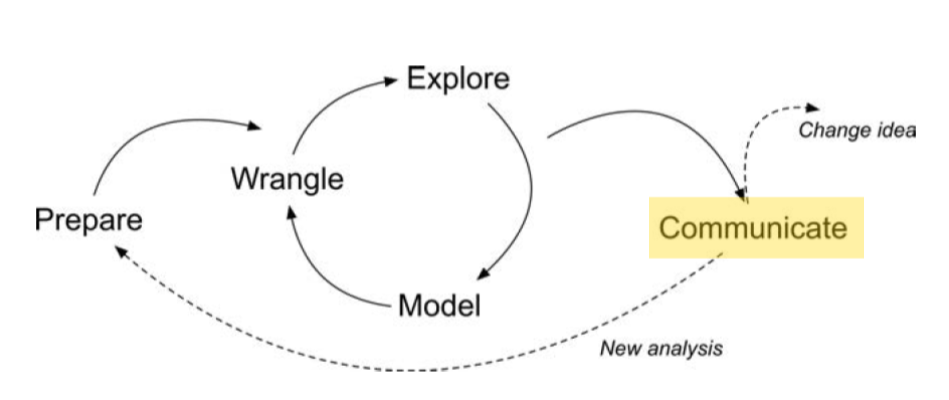
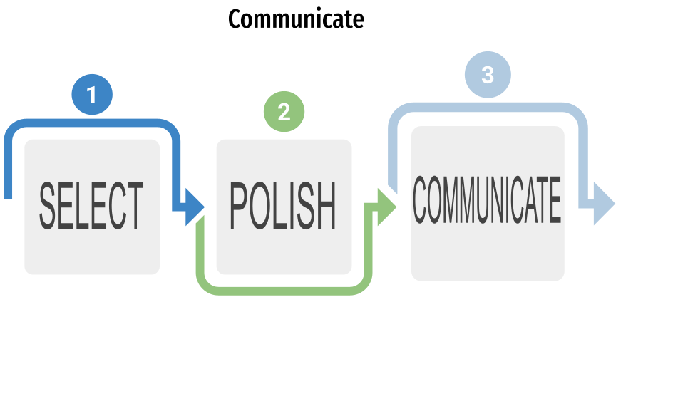
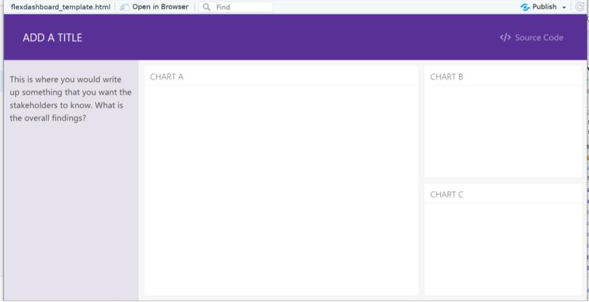
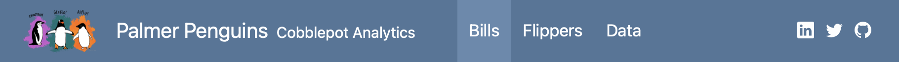
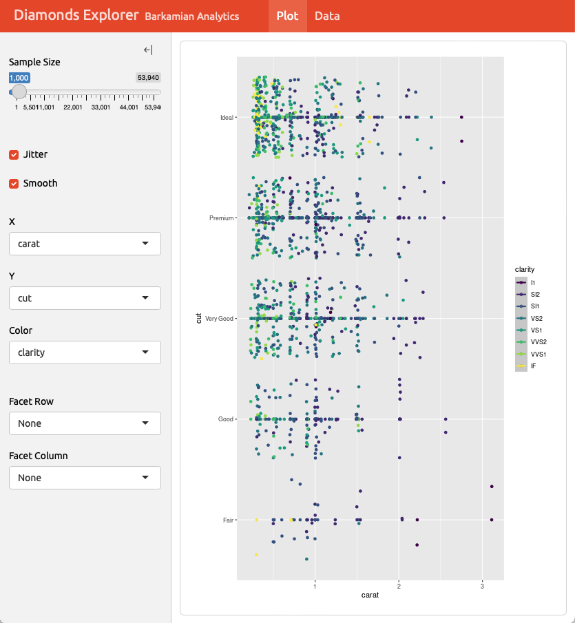
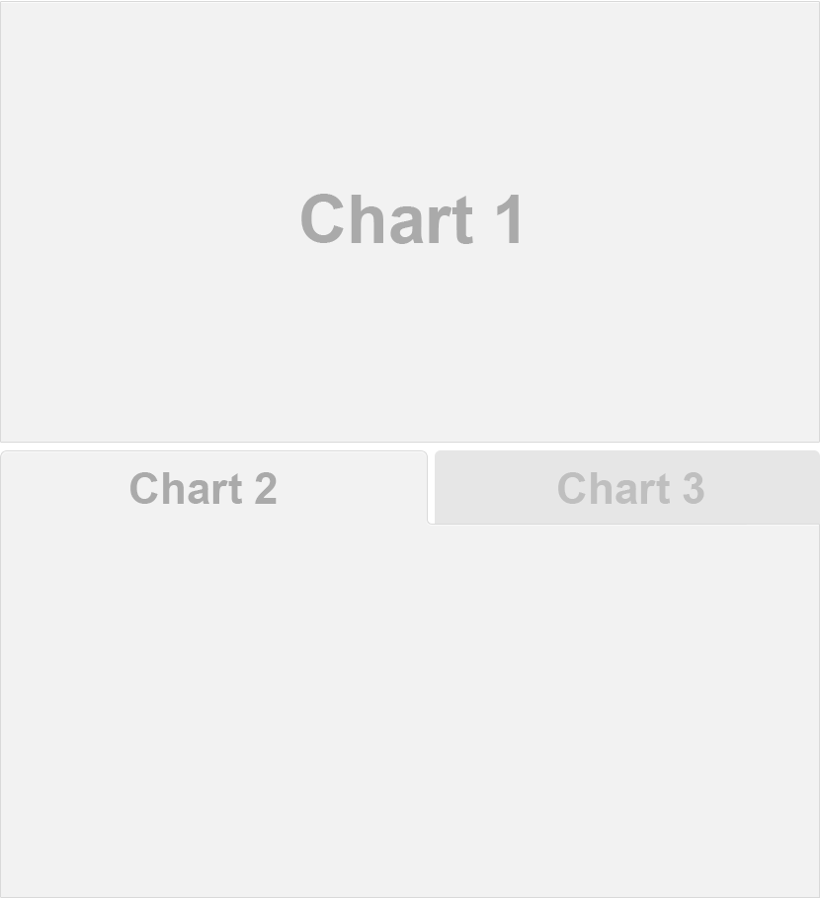
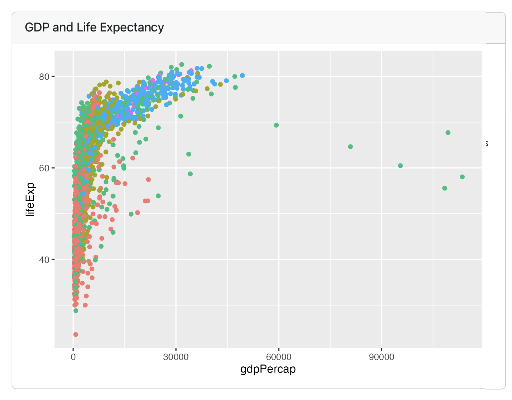
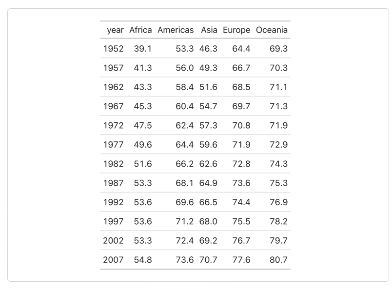

## Welcome to the LAW Code Along for Module 4

. . .

{width="1450"}

. . .

- The *Communicate* phase of the LAW is about selecting, polishing, and
  presenting findings to an audience.

::: notes
- In the *Communicate* phase of the Learning Analytics workflow, the
  focus is on effectively presenting and sharing the results of your
  analysis with stakeholders. This involves creating clear and
  compelling visualizations, writing comprehensive reports, and
  delivering presentations that highlight key insights and actionable
  recommendations.
- The goal is to ensure that the findings are easily understood and can
  inform decision-making processes, ultimately leading to improved
  educational outcomes. Utilizing tools like `ggplot2` for
  visualizations and packages like RMarkdown for report generation can
  enhance the clarity and impact of your communication.
:::

## Module Objectives

By the end of this module, learners will:

. . .

- Develop an intuition for the *Communication* phase of the learning
  analytics workflow.

. . .

- Understand the utility and power of dashboards for data communication.

. . .

- Build a dashboard of their own, experimenting with its modular
  components (e.g., tabs, plots, sidebars, etc.).

## Preparing Findings for Communication



::: notes
Earlier in the LAW, such as in the *Explore* phase, you might have
wondered how you could ever find a compelling or concrete finding from
all of the data. In the *Communicate* phase, you might find yourself
with the opposite problem: Which findings should I pick and share?

Krumm et al. (2018) have outlined the following 3-step process for
communicating with education stakeholders what you have learned through
analysis:

- Select: Communicating what one has learned involves selecting among
  those analyses that are most important and most useful to an intended
  audience, as well as selecting a form for displaying that information,
  such as a graph or table in static or interactive form, i.e.a "data
  product."

- Polish: After creating initial versions of data products, research
  teams often spend time refining or polishing them, by adding or
  editing titles, labels, and notations and by working with colors and
  shapes to highlight key points.

- Communicate: Writing a narrative to accompany the data products
  involves, at a minimum, pairing a data product with its related
  research question, describing how best to interpret the data product,
  and explaining the ways in which the data product helps answer the
  research question.
:::

## Dashboards for Communication

::: panel-tabset
### Overview

- Dashboards are one of the most flexible ways you can communicate
  findings with R!

- Like other data products, they can be coded using R and R Markdown,
  and knitted using Quarto.

### Components

- **Navigation bar**: Icon, title, and author along with links to
  sub-pages if needed

- **Pages, rows, & columns**: Defined using markdown headings (with
  optional attributes to control height, width, etc.)

- **Tabsets**: Used to further divide content within a row or column

- **Cards**: Containers for plots, data display, and free form content,
  typically mapped to cells in your notebook or source document

- **Sidebars and toolbars**: Present inputs within interactive
  dashboards

### YAML

To make your markdown file a dashboard, use the YAML header to specify
"flexdashboard".

```{r echo=TRUE, eval=FALSE}
---
title: "ADD A TITLE"
output:
  flexdashboard::flex_dashboard:
    theme: 
      version: 4
      bootswatch: pulse
    source_code: embed
  html_document:
    df_print: paged
editor_options: 
  chunk_output_type: console
---
  
```
:::

::: notes
- Dashboards combine the strengths of the other data products we have
  discussed.

- They are essentially little websites that give viewers the ability to
  explore your findings, view and download data, and even adjust and
  interact with visualizations.

- Since they are built with HTML, dashboards:

  - Are essentially universal and readable by any device or browser.

- Keep in mind that they have no password protection. This makes
  distribution easy but requires extra care when sharing your data
  (particularly "raw" data).
:::

## The Basic Dashboard



::: notes
The boilerplate dashboard format uses basic web design principles, with
titles and overview subjects at the top and your findings below. Basic
dashboards are not unlike poster presentations, but they can be built
upon to be much more than that.
:::

## Navigation Bar and Pages



::: {style="margin-top: 0.7em;"}
``` markdown
--- 
title: "Palmer Penguins"
author: "Cobblepot Analytics"
format: 
  dashboard:
    logo: images/penguins.png
    nav-buttons: [linkedin, twitter, github]
---

# Bills

# Flippers

# Data
```
:::

::: notes
Using the markdown language for headers, dashboards give users the
ability to navigate through different pages both vertically and
horizontally.
:::

## Sidebars: Global

::::: columns
::: column
```` {.markdown style="margin-top: 45px;"}
---
title: "Global Sidebar"
format: dashboard
---
    
# {.sidebar}

Sidebar content (e.g. inputs)

# Plot

```{{r}}
```

# Data

```{{r}}
```
````
:::

::: {.column .fragment}
{width="80%"}
:::
:::::

::: notes
Global sidebars are shown at the top of the dashboard by default, and
give users the ability to switch between pages. If you had three major
findings, for example, this is where users would go between them.
:::

## Sidebars: Page Level

::::: columns
::: column
```` {.markdown style="margin-top: 45px;"}
---
title: "Sidebar"
format: dashboard
---
    
# Page 1

## {.sidebar}

```{{r}}
```

## Column 

```{{r}}
```

```{{r}}
```
````
:::

::: {.column .fragment}

:::
:::::

::: notes
You can nest sidebars within individual pages. For example, you may have
two distinct takeaways, visualizations, etc. to better convey a single
finding, so you would make one page for your finding, then use the
sidebar to show different aspects of that finding.
:::

## Layout: Rows

::::: columns
::: {.column style="margin-top: 65px;"}
```` markdown
---
title: "Focal (Top)"
format: dashboard
---
    
## Row {height=70%}

```{{r}}
```

## Row {height=30%}

```{{r}}
```

```{{r}}
```
````
:::

::: {.column .fragment}
{width="90%"}
:::
:::::

::: notes
You can arrange dashboard components in rows...
:::

## Layout: Columns

::::: columns
::: {.column style="margin-top: 40px;"}
```` markdown
---
title: "Focal (Top)"
format: 
  dashboard:
    orientation: columns
---
    
## Column {width=60%}

```{{r}}
```

## Column {width=40%}

```{{r}}
```

```{{python}}
```
````
:::

::: {.column .fragment}

:::
:::::

::: notes
...or columns!
:::

## Tabsets

::::: columns
::: {.column style="margin-top: 45px;"}
```` markdown
---
title: "Palmer Penguins"
format: dashboard
---
    
## Row

```{{r}}
```

## Row {.tabset}

```{{r}}
#| title: Chart 2
```

```{{r}}
#| title: Chart 3
```
````
:::

::: {.column .fragment}
{width="700"}
:::
:::::

::: notes
Tabsets are tab structures nested within a single component on the page.
You can see how you can end up giving viewers a lot of places to click,
so use all of these methods judiciously! Less is more. And remember: You
can always add more sidebars and tabsets later.
:::

## Plots

::::: columns
::: {.column .fragment .smaller}
```` r
```{{r}}
#| title: GDP and Life Expectancy
library(gapminder)
library(tidyverse)
ggplot(gapminder, aes(x = gdpPercap, y = lifeExp, color = continent)) +
  geom_point()
```
````
:::

::: {.column .fragment}
{width="85%"}
:::
:::::

::: notes
You can imbed visualizations via `ggplot` directly into your dashboards.
Each code chunk makes a card, and can take a title.
:::

## Tables

::::: columns
::: {.column .fragment .smaller}
```` r
```{{r}}
library(gapminder)
library(tidyverse)
library(gt)
gapminder |>
  group_by(continent, year) |>
  summarize(mean_lifeExp = round(mean(lifeExp), 1)) |>
  pivot_wider(names_from = continent, values_from = mean_lifeExp) |>
  gt()
```
````
:::

::: {.column .fragment}
{width="85%"}
:::
:::::

::: notes
The same goes for tables. Each code chunk makes a card, and **doesn't**
have to have a title.
:::

## Other Features

- Text content

- Value boxes

- Expanding cards

- [Interactive
  elements](https://quarto.org/docs/dashboards/interactivity/shiny-r)

  - For interactive exploration, some dashboards can benefit from a live
    R backend.

  - To do this with Quarto, add interactive
    [Shiny](https://shiny.posit.co) components.

  - Deploy with or without a server!

## 👉 Your Turn ⤵

Create a data story with our current data set.

::: incremental
- Develop a research question.
- Add `ggplot` visualizations.
- Model your visualizations.
- Add a short write up for the intended stakeholders.
:::

. . .

### Resources

[Quarto Dashboards in R](https://quarto.org/docs/dashboards/)

[Quarto Dashboard gallery](https://quarto.org/docs/gallery/#dashboards)

[**Interactive** dashboards for
R](https://posit.co/blog/flexdashboard-easy-interactive-dashboards-for-r/)

# What's Next? {background="#143156"}

::: {style="text-align: left; font-size: 50px"}
- Complete the *Communicate* part of the [case
  study](https://posit.cloud/spaces/493094/join?access_code=qjsumVzA0HZYgrxOSizVbVPmDs7iHYS32yUQaqDe)
- Complete the [Data Products
  badge](https://laser-institute.github.io/la-workflow/Foundation_R/module_4/Module4-badge-R-KEY.html)
- Optional: Complete the [LAW
  Microcredential](https://laser-institute.github.io/la-workflow/microcredential/law-microcredential.html)
:::
